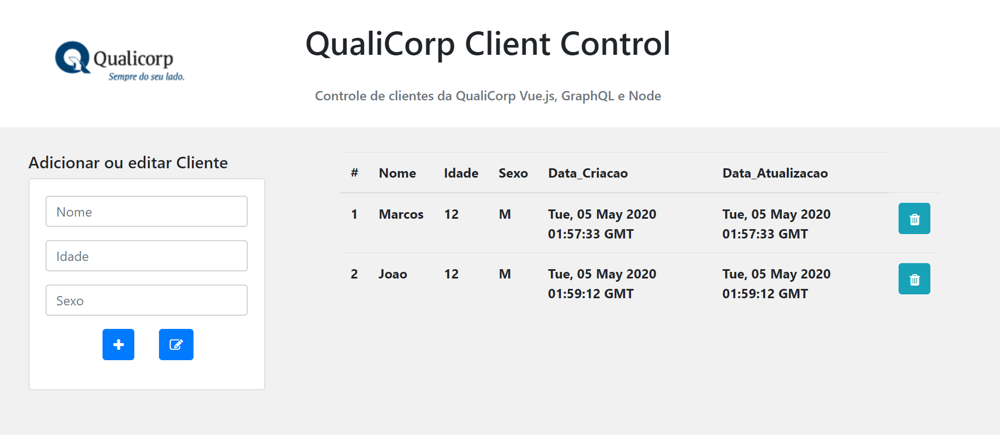

# Crud de CLientes para a Qualicorp

Este projeto é um sistema de crud de client utilizando vue.js no front e node.js
no backend, persistindo dados no banco orientado a grafos Neo4J

## Installation

Para instalar as dependencias do projeto, rodar o comando npm i nos diretorios client e 
server localizados na raiz do projeto.

## Neo4J

O arquivo neo4jconfig contem os parametros de conexão com o Neo4J. Para a sua configuração 
de conexão, atualizar este arquivo. O parametros são repectivamente {url};{user};{password}

## Run

Para rodar o projeto, executar os comandos
[Front] npm run serve - no diretorio client
[Back] npm run serve - no diretorio serrver

Abrir a aplicação no Google Chrome no endereço http://localhost:8080/

## License
 (C) Marcos Moura, 05/05/2020